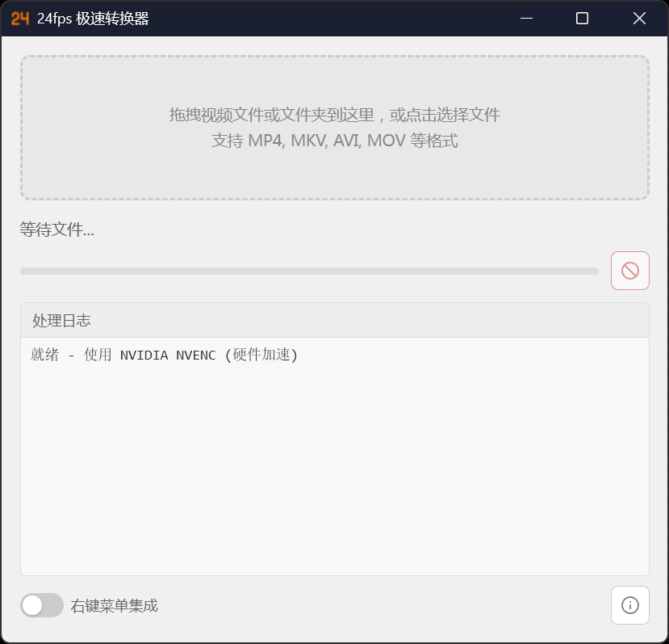

# 24fps 极速转换器

> 只做 24 帧转换，别的不管。



## 为什么存在

即梦生成的视频通常不是准的24帧，导致视频在自家对帧数波动支持较差的剪辑中会“卡”。虽市面上已经存在了很多视频转换软件，但每次都要调整设置也太麻烦了，于是就诞生了这个软件——

这个工具只解决一个问题：**把视频转到 24fps**。没有多余选项，没有复杂设置，拖进去就转。

## 特性

- **单一功能** —— 只做 24fps 转换，界面只有一个按钮的距离
- **极轻量** —— 基于 [Tauri](https://tauri.app) 构建，安装包远小于 Electron 方案
- **硬件加速** —— 自动检测并使用最佳编码器（NVENC / Intel QSV / VideoToolbox / libx264）
- **批量处理** —— 支持多文件/文件夹拖放，队列依次转换
- **实时进度** —— 每个文件的转换进度与日志实时可见
- **右键集成** —— 右键菜单直接转换，无需打开主窗口
- **命令行模式** —— 支持 headless 模式，可接入自动化脚本

--- 

## 开发向快速开始

### 环境要求

- [Node.js](https://nodejs.org/) >= 18
- [Rust](https://www.rust-lang.org/) 工具链
- [Tauri CLI](https://tauri.app/start/prerequisites/)

### 开发

```bash
# 安装依赖
npm install

# 启动开发模式
npm run tauri dev
```

### 构建

```bash
# 生产构建（使用 build.bat）
build.bat
```

## 技术栈

| 层级 | 技术 |
|------|------|
| 桌面框架 | [Tauri 2.0](https://tauri.app) |
| 前端 | React + Vite + Tailwind CSS |
| 后端 | Rust |
| 视频引擎 | FFmpeg（内置 sidecar） |

## 项目结构

```
├── src/                    # React 前端
├── src-tauri/
│   ├── src/
│   │   ├── converter/      # 核心转换逻辑
│   │   │   ├── ffmpeg.rs       # FFmpeg 集成
│   │   │   ├── command_builder.rs  # 命令构建
│   │   │   └── encoder.rs       # 编码器检测
│   │   ├── context_menu/    # 右键菜单集成
│   │   ├── headless.rs      # CLI 模式
│   │   └── single_instance.rs  # 单实例锁
│   └── Cargo.toml
├── resources/              # 资源文件
└── .github/workflows/      # CI/CD 自动构建
```

## 许可证

MIT License
